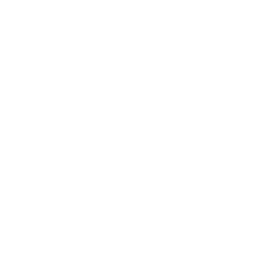
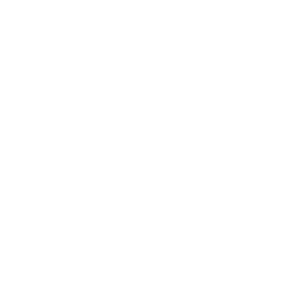
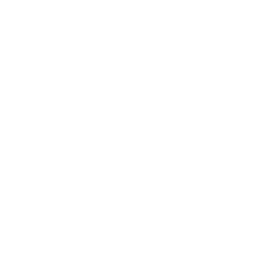

## Weapon combinations

[Click here to return to the main page.](Weapons-Guide.md)

*NOTE: This guide does not apply to mutators like Arena, where all weapons are available, or mutators that severely restrict loadouts, like Kaboom, Medieval, Instagib etc.*

While every weapon in Red Eclipse is capable of turning your enemies into dust, their shortcomings start becoming very apparent during various situations: the Super Shotgun, for example, cannot do much but pepper people from a distance, and its alt-fire is too slow to consistently hit enemies from afar; the Laser Rifle, on the other hand, slows you down horribly while zoomed in, and is a very unwieldy weapon, meaning that opponents that get too close have a good chance of annihilating you.

Different weapon combinations allow you to adapt to such situations, covering your weaknesses, or adopt playstyles that normally would not be possible with other weapons. While the options are vast, there is a limited amount of weapons in the game, and as such, all of them can be put into this article.

Just like with singular weapons, there are certain criteria the loadouts are rated under:
- *Utility ratings* determine how versatile a loadout is in regards to its predominant use strategy, or if its strategy in itself is versatile.
- *Range ratings* determine the overall potential of the loadout to project force not just over large distances, but in different effective ranges. Treat this more as where the weapons excel most, rather than if they can fire far.
- *Difficulty ratings* determine how easy it is to use the loadout.
- *Overall performance ratings* attempt to summarize these criteria, alongside a few others, to show how well this loadout performs compared to others. The higher the score, the better.

Just like with weapon ratings, remember that these are very arbitrary. Please use these ratings as a quick measure of a loadout's effectiveness, rather than an accurate definition of its power. Just because you are using the two most powerful weapons in the game does not mean you are going to instantly become the best player in the world.   

### Sword + Shotgun
 

| Utility | Range | Difficulty | *Overall performance* |
|---------------|---------------|----------------|----------------|
| Limited (☆☆) | Narrow (☆☆) | Medium (☆☆☆) | Below average (☆☆☆☆) |

Get in, shoot people, finish them off with the Sword, get out. That's the general strategy for this loadout, as it lacks range, but certainly doesn't lack speed or DoT effects. One problem: these two weapons do not work that well together.

The Shotgun will most likely take the bulk of the kills in this loadout, being way more effective at murdering people from up close than the Sword is, while the Sword can be used once you run out of shells, or as a quick way to annoy someone with bleed damage and leave. In addition, the Shotgun's alt-fire certainly helps make up for the poor range by letting you spam rather costly projectiles from afar.

What is the problem here, exactly? There are better options for either weapon: the Shotgun does not need to be complimented by a short-range hit-and-run weapon, since it tends to instantly delete enemies that are too close, and similarly, the Sword's weaknesses are barely even covered by the Shotgun, which has neither the range nor the weight to let the Sword do its thing better. Overall, not the best loadout, but anything with the Shotgun can get kills with relative ease, provided your aim is on point, and anything with the Sword moves very fast. It loses a lot of points for gimping what could be an entirely viable way to cover the weakness of either weapon.

### Sword + SMG

 

| Utility | Range | Difficulty | *Overall performance* |
|---------------|---------------|----------------|----------------|
| Adaptable (☆☆☆) | Adequate (☆☆☆) | Medium (☆☆☆) | Well above average (☆☆☆☆☆☆☆) |

Kind of similar to the Shotgun strategy, but you have much more leeway in what range you want to approach your enemies from, and you can always get out. The best benefit of this loadout is that it combines the two lightest weapons in the game, which gives you an insane maneuverability boost that you physically cannot have with other loadouts.

The SMG alone boosts the effective range of this loadout by a long shot. Should you ever find yourself running out of bullets, you can always fall back to the Sword or run away, but you can very easily be an annoyance at any range, especially since the SMG reloads very fast. Anyone attempting to run away will have a hard time, as your chip damage abilities are certainly above par (both with stray SMG bullets and bleed damage), and the occasional alt-fire kill of either the SMG or the Sword can be a nasty surprise.

While you may run into trouble holding your own against weapons like the Shotgun, you will find that outranging such weapons is a piece of cake, and that you can be a nasty little skitterbug for as long as you like. Try out this combo - compared to others, it may not be the most effective, but it certainly is something, especially for objective-based gamemodes!

### Sword + Flamer

 

| Utility | Range | Difficulty | *Overall performance* |
|---------------|---------------|----------------|----------------|
| Elastic (☆☆☆☆) | Confined (☆) | Low (☆☆) | Well above average (☆☆☆☆☆☆☆) |

Combining the two shortest-ranged weapons in the game may seem like an idiotic idea at first. Don't they both cover the exact same effective range? Won't they just get in each other's way? Aren't you going to get easily picked off by anyone that has even the slightest idea on what you're doing?

As it turns out, yes, no and no. Similarly to the Shotgun and SMG, you might find yourself adopting a rushdown strategy. This is to be expected, but where does the bulk of this loadout's potential truly lie? In status effects! You can start burning somebody with the Flamethrower and then switch to the Sword to lop their head off, and they will take 30 damage in 5 seconds. You can do it in the opposite direction to achieve the exact same result (which matters, as every time a status effect is reapplied, it skips its damage tick), and you can mix and match DoT effects for different situations. It is really easy to hit somebody with either weapon (especially the Flamethrower), and both weapons cover each other's weaknesses in every department but range - the Flamethrower's weakness being ridiculous ammo consumption, which the Sword covers by not requiring any ammunition, and the Sword's weakness being lack of crowd control, which the Flamethrower excels in. On top of that, since neither weapon is particularly heavy, you open up many interesting avenues regarding movement techniques, like air blast jumps to save yourself some impulse.

The obvious weakness of this loadout is that you need to get close to people to actually play the game, which was said in every paragraph already. This can really hurt against certain weapons (the Laser Rifle and the Electro-Zapper being your main weaknesses), so engage them carefully and ambush them whenever you can. However, you will find that it's not nearly as hard as you would expect, and while not a loadout with the strongest damage potential, it certainly performs better than it looks at first glance! Turn your brain off and slice away. Or don't turn your brain off. You might wanna, though, since it's about to get heated.

### Sword + Plasma

 

| Utility | Range | Difficulty | *Overall performance* |
|---------------|---------------|----------------|----------------|
| Limited (☆☆) | Narrow (☆☆) | Low (☆☆) | Well below average (☆☆☆) |

A weapon combination doomed from the start, both lack enough damage output to compliment each other well, and have several other problems that are very much worth pointing out, but at least do not lack movement speed and still do what they do best regardless.

The Plasma Inductor's primary fire is good specifically at a medium range, not because it sucks for any obvious reason at short and long ones, but because other weapons in the game are more powerful at these ranges than it is. So already, you are limiting yourself to a weapon that works at its best when supported with something that covers these ranges, which the Sword cannot do at all for long ones, and struggles to keep up with the damage output of other short-range weapons. You have to switch between playing the ranged game with the Plasma and stabbing people with the Sword, and sometimes, that will just not work out for you since one requires consistently staying far away from your opponents, and the other requires commitment to a battle at a short range, which are very contrasting goals that do not work that well together.

One of the worst parts about this loadout is that the Plasma alt-fire has absolutely no synergy with the Sword. At least every other gun in the game can hurl some shots at whatever is locked inside of the big blue ball of death (even the Flamer, though it is ill-advised), but the Sword lacks any range to even attempt to do that. Should you be suicidal enough to try throwing yourself inside as a last-ditch attempt to finish an enemy off, the attraction effect makes it very hard to hit anything while inside the ball. Of course, just because it's rated so low does not mean you cannot get kills with it, and it can prove a decent challenge to the veterans of the game to use these two weapons effectively with one another. But you are probably better off trying something else.

### Shotgun + SMG

 

| Utility | Range | Difficulty | *Overall performance* |
|---------------|---------------|----------------|----------------|
| Adaptable (☆☆☆) | Vast (☆☆☆☆☆) | Medium (☆☆☆) | Playstyle-defining (☆☆☆☆☆☆☆☆☆☆) |

The extremely powerful Shotgun + SMG loadout is in frequent use by psychopaths that regularly escape the mental wards they are locked in so that they can indiscriminately slaughter twenty people and get a free Rocket Launcher, which is, to say, a lot of the Red Eclipse playerbase. Where do we even begin for these two absolutely beastly weapons?

You move at a fairly fast pace for a hyper-aggressive playstyle that demands constantly assaulting your opponents, with a decent range coverage, but not particularly excessive. Your damage potential is at its peak at short range, both weapons in your arsenal capable of removing whatever problematic opponent even attempts to run away from you, but leaving you somewhat vulnerable when you are the one trying to run away and recover.

Both weapons cover each other's weaknesses phenomenally. Need to get someone out of your face? Use the Shotgun. Need to pick someone off from a distance, or from around a corner? Use the SMG. Need to get some quick DoT in to curb an enemy's regen for a significant portion of the fight? Use the Shotgun (it's not that good at that, but shut up). Need to reload your Shotgun? Use the SMG. Need to scare away your opponents from an objective? Use the Shotgun. Need to run away and fend off an attacker? Use the SMG. The list goes on, but no matter what you do, there is always going to be a situation where you can use either weapon to its fullest potential. Needless to say, no one will be surprised when you go on a killing spree with this loadout. Just remember that you are not invincible and anything that walks will eventually wither away.

### SMG + Zapper

 

| Utility | Range | Difficulty | *Overall performance* |
|---------------|---------------|----------------|----------------|
| Adaptable (☆☆☆) | Expansive (☆☆☆☆☆) | Medium (☆☆☆) | Playstyle-defining (☆☆☆☆☆☆☆☆☆☆) |

The true generalist's loadout: what is better than having one gun that works at all ranges? Having two of them. It's very easy to understand why this works, since both guns are quite similar on the surface level, but fairly different when you get into the specifics.

At first, it may seem a bit counter-intuitive to combine two weapons that work well at the same ranges, until you realize that they already work well at all of them, which bolsters the force projection of your arsenal to scandalous levels. Even though the SMG is less effective at longer ranges than the Zapper, it can still scratch people for some chip damage, and the Zapper can just as well hurt people at closer ranges that the SMG is better at. Does one outshine the other in any way, since they are so similar? Not really. If anything, the fact that they can be used so interchangably means you will be prepared for enemies no matter what, be it in offensive or defensive scenarios, and your movement speed is not impacted too harshly. 

One big weakness of this playstyle is that you are just a little bit more predictable than other players. Sure, with the occasional ricochet off a wall or the Zapper alt-fire blasting all over someone's face, you can get some interesting kills, but you will be doing more of the same with these two weapons. Still, while somewhat plain, it is effective. Very effective. Pick it over Shotgun + SMG in case you are fighting with the Duel mutator on and are struggling to get close enough to your enemy.

### Plasma + Corroder

 

| Utility | Range | Difficulty | *Overall performance* |
|---------------|---------------|----------------|----------------|
| Versatile (☆☆☆☆☆) | Adequate (☆☆☆) | Hard (☆☆☆☆) | Excellent (☆☆☆☆☆☆☆☆) |

Unexpectedly, these two guns work together phenomenally. The main idea here is that Plasma provides a consistent damage output, while Corroder lets you take higher risks for much bigger rewards. The end result is a loadout that excels at farming assist points (yes, really, you can win games like this), fighting at medium range, area denial at any range and being an extremely unpredictable nuisance overall.

As said above, you will be fighting primarily at medium range, with Plasma chipping away at your enemies and the Corroder nailing those sweet headshots to instantly eradicate them. Or maybe not even headshotting them. You will want to stay at this range, as the Corroder's alt-fire blobs can be dodged rather easily from far away, and up close, its primary fire is incredibly unreliable, mostly stopping people that slam into your face. What can this loadout do? Many, many things that others cannot. You can set up traps everywhere from ridiculous ranges. You can melt people's faces off (well, sort of) when they approach you and very easily finish them off as they're trying to run away, thanks to Plasma's ease of use and Corroder's DoT. You can weave and dodge around their bullets while severely reducing their options to do the same. You can even tell people to fuck off by throwing a big plasma ball at them and then pelting them with Corroder blobs while they're magnetized (which turns out to be an insanely powerful maneuver). The possibilities are... probably not endless, but definitely above most other weapons in RE.

Try it! It's not nearly as high-powered as SMG + Shotgun is, it does not have the insane range coverage as Zapper + Rifle does, and it certainly does not work for every situation as well as SMG + Zapper does. You will not win games as easily, either. But what it makes up for with all of that in mind is that you end up being a complete wildcard to most people. You can switch your goals almost on a whim and especially show off during gamemodes other than Deathmatch, since this loadout is particularly amazing at supporting teammates with more firepower.

### Zapper + Rifle

 

| Utility | Range | Difficulty | *Overall performance* |
|---------------|---------------|----------------|----------------|
| Limited (☆☆) | Broad (☆☆☆☆) | Hard (☆☆☆☆) | Playstyle-defining (☆☆☆☆☆☆☆☆☆☆) |

A cruel loadout for the most deranged (ha-ha) of Red Eclipse players, this one requires skill, precision, correct positioning and a lethal amount of anti-depressants to cope with the fact that you are using the two heaviest loadout weapons in the game... together. What comes of it is entirely up to the user, but it tends to be particularly good at making the lives of your opponents a living hell.

The Laser Rifle is at its best when you are left unbothered, so you can safely ventilate the heads of your opponents from far away. But what's that? You accidentally shot them in the dick because a local bird pecked your scope at the exact moment you fired your weapon, and now they are charging straight at you with half of their health left? No problem! Use the Zapper to finish them off and ruin their chances at exacting revenge upon you, forever. Basically, you are very much mortal while using this loadout, but you can get away with a lot, as the Zapper functions well at ANY range, essentially giving you unparalleled reign over any sightline and giving you an oppressive effective range that most dictators wish they had. It covers the various tiny problems that the Laser Rifle has as well, letting you snipe away with both weapons.

The biggest weakness of this loadout is... well... you can't run away too easily. You're heavy, VERY heavy. Reloading is another problem - while the Zapper reloads faster than the Rifle, it still is not the fastest weapon in this department, and it certainly is not the most damaging of the bunch, either. If you are caught with your pants down, you will most likely die. But you don't have to get caught, is the thing...

### 
