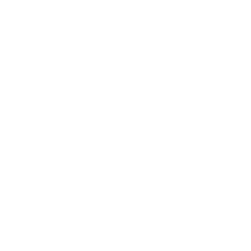
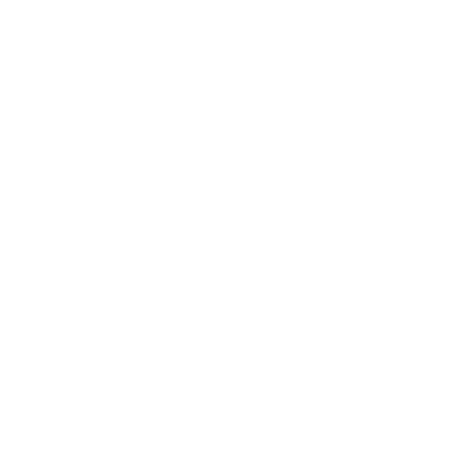
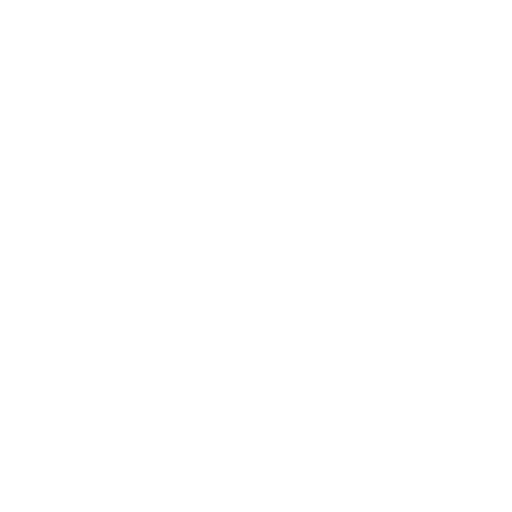
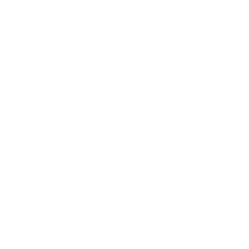

## Weapon combinations

[Click here to return to the main page.](Weapons-Guide.md)

*NOTE: This guide does not apply to mutators like Arena, where all weapons are available, or mutators that severely restrict loadouts, like Kaboom, Medieval, Instagib etc.*

While every weapon in Red Eclipse is capable of turning your enemies into dust, their shortcomings start becoming very apparent during various situations: the Super Shotgun, for example, cannot do much but pepper people from a distance, and its alt-fire is too slow to consistently hit enemies from afar; the Laser Rifle, on the other hand, slows you down horribly while zoomed in, and is a very unwieldy weapon, meaning that opponents that get too close have a good chance of annihilating you.

Different weapon combinations allow you to adapt to such situations, covering your weaknesses, or adopt playstyles that normally would not be possible with other weapons. While the options are vast, there is a limited amount of weapons in the game, and as such, all of them can be put into this article.

Just like with singular weapons, there are certain criteria the loadouts are rated under:
- *Utility ratings* determine how versatile a loadout is in regards to its predominant use strategy, or if its strategy in itself is versatile.
- *Range ratings* determine the overall potential of the loadout to project force not just over large distances, but in different effective ranges. Treat this more as where the weapons excel most, rather than if they can fire far.
- *Difficulty ratings* determine how easy it is to use the loadout.
- *Overall performance ratings* attempt to summarize these criteria, alongside a few others, to show how well this loadout performs compared to others. The higher the score, the better.

Just like with weapon ratings, remember that these are very arbitrary. Please use these ratings as a quick measure of a loadout's effectiveness, rather than an accurate definition of its power.   

### Sword + Shotgun
 

| Utility | Range | Difficulty | *Overall performance* |
|---------------|---------------|----------------|----------------|
| Limited (☆☆) | Narrow (☆☆) | Medium (☆☆☆) | Below average (☆☆☆☆) |

Get in, shoot people, finish them off with the Sword, get out. That's the general strategy for this loadout, as it lacks range, but certainly doesn't lack speed or DoT effects. One problem: these two weapons do not work that well together.

The Shotgun will most likely take the bulk of the kills in this loadout, being way more effective at murdering people from up close than the Sword is, while the Sword can be used once you run out of shells, or as a quick way to annoy someone with bleed damage and leave. In addition, the Shotgun's alt-fire certainly helps make up for the poor range by letting you spam rather costly projectiles from afar.

What is the problem here, exactly? There are better options for either weapon: the Shotgun does not need to be complimented by a short-range hit-and-run weapon, since it tends to instantly delete enemies that are too close, and similarly, the Sword's weaknesses are barely even covered by the Shotgun, which has neither the range nor the weight to let the Sword do its thing better. Overall, not the best loadout, but anything with the Shotgun can get kills with relative ease, provided your aim is on point, and anything with the Sword moves very fast. It loses a lot of points for gimping what could be an entirely viable way to cover the weakness of either weapon.

### Sword + SMG

 

| Utility | Range | Difficulty | *Overall performance* |
|---------------|---------------|----------------|----------------|
| Adaptable (☆☆☆) | Adequate (☆☆☆) | Medium (☆☆☆) | Well above average (☆☆☆☆☆☆☆) |

Kind of similar to the Shotgun strategy, but you have much more leeway in what range you want to approach your enemies from, and you can always get out. The best benefit of this loadout is that it combines the two lightest weapons in the game, which gives you an insane maneuverability boost that you physically cannot have with other loadouts.

The SMG alone boosts the effective range of this loadout by a long shot. Should you ever find yourself running out of bullets, you can always fall back to the Sword or run away, but you can very easily be an annoyance at any range, especially since the SMG reloads very fast. Anyone attempting to run away will have a hard time, as your chip damage abilities are certainly above par (both with stray SMG bullets and bleed damage), and the occasional alt-fire kill of either the SMG or the Sword can be a nasty surprise.

While you may run into trouble holding your own against weapons like the Shotgun, you will find that outranging such weapons is a piece of cake, and that you can be a nasty little skitterbug for as long as you like. Try out this combo - compared to others, it may not be the most effective, but it certainly is something, especially for objective-based gamemodes!

### Sword + Flamer

 

| Utility | Range | Difficulty | *Overall performance* |
|---------------|---------------|----------------|----------------|
| Elastic (☆☆☆☆) | Minuscule (☆) | Low (☆☆) | Well above average (☆☆☆☆☆☆☆) |

Combining the two shortest-ranged weapons in the game may seem like an idiotic idea at first. Don't they both cover the exact same effective range? Won't they just get in each other's way? Aren't you going to get easily picked off by anyone that has even the slightest idea on what you're doing?

As it turns out, yes, no and no. Similarly to the Shotgun and SMG, you might find yourself adopting a rushdown strategy. This is to be expected, but where does the bulk of this loadout's potential truly lie? In status effects! You can start burning somebody with the Flamethrower and then switch to the Sword to lop their head off, and they will take 30 damage in 5 seconds. You can do it in the opposite direction to achieve the exact same result (which matters, as every time a status effect is reapplied, it skips its damage tick), and you can mix and match DoT effects for different situations. It is really easy to hit somebody with either weapon (especially the Flamethrower), and both weapons cover each other's weaknesses in every department but range - the Flamethrower's weakness being ridiculous ammo consumption, which the Sword covers by not requiring any ammunition, and the Sword's weakness being lack of crowd control, which the Flamethrower excels in. On top of that, since neither weapon is particularly heavy, you open up many interesting avenues regarding movement techniques, like air blast jumps to save yourself some impulse.

The obvious weakness of this loadout is that you need to get close to people to actually play the game, which was said in every paragraph already. This can really hurt against certain weapons (the Laser Rifle and the Electro-Zapper being your main weaknesses), so engage them carefully and ambush them whenever you can. However, you will find that it's not nearly as hard as you would expect, and while not a loadout with the strongest damage potential, it certainly performs better than it looks at first glance! Turn your brain off and slice away.

### Shotgun + SMG

 

| Utility | Range | Difficulty | *Overall performance* |
|---------------|---------------|----------------|----------------|
| Adaptable (☆☆☆) | Broad (☆☆☆☆) | Medium (☆☆☆) | Playstyle-defining (☆☆☆☆☆☆☆☆☆☆) |

The extremely powerful Shotgun + SMG loadout is in frequent use by people that love running into people and then murdering them indiscrimninately, which is, to say, a lot of them. Where do we even begin for these two absolutely beastly weapons?

You move at a fairly fast pace for a playstyle that demands constantly assaulting your opponents, with

The Shotgun is a boomstick that can remove any problems that come close to you, while the SMG can clean up whatever stragglers you sent packing. 

### Plasma + Corroder

### Zapper + Rifle

### 
